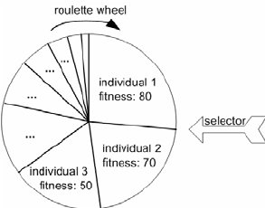
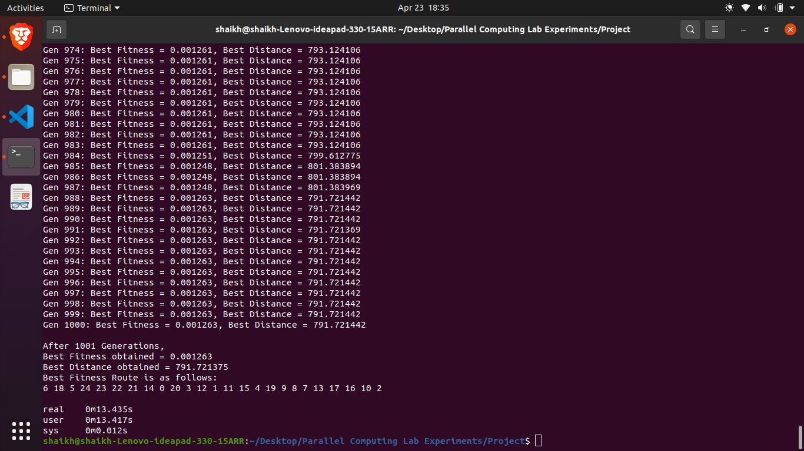
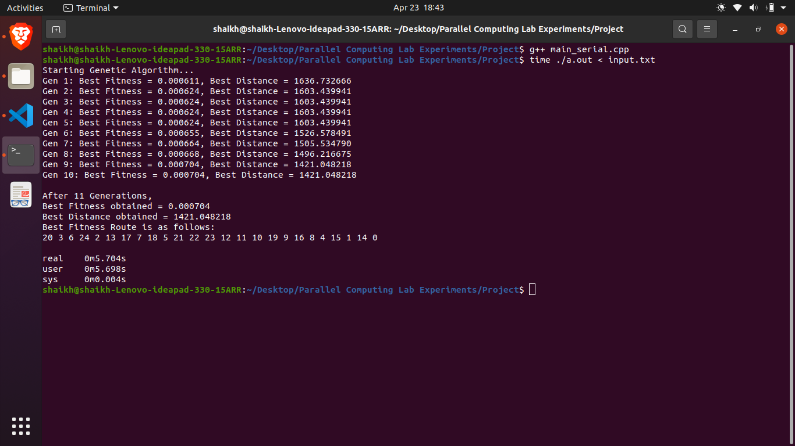
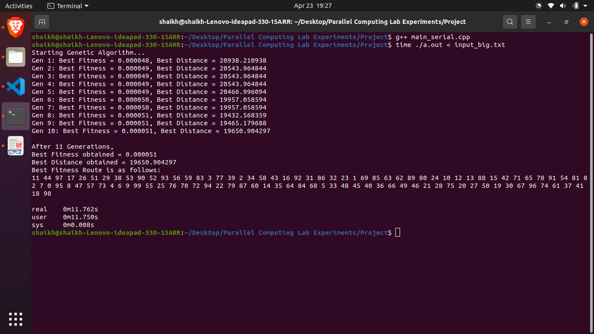
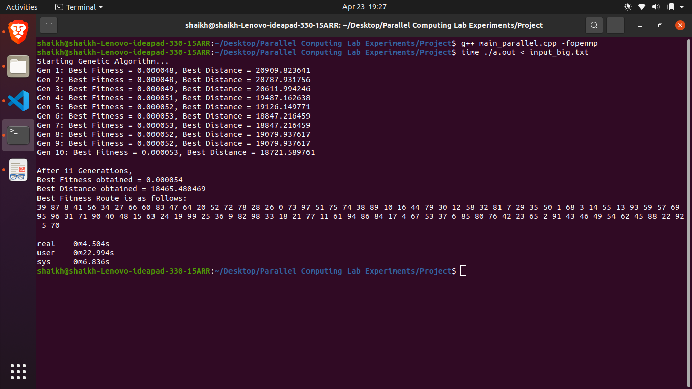

<html><head><meta content="text/html; charset=UTF-8" http-equiv="content-type"></head><body class="c29">

<h1>Parallel Computing Lab - Assignment 4

Mohd Ubaid Shaikh

Roll no. 180001050

Under the Guidance of

Dr. Chandresh Kumar Maurya

Computer Science and Engineering

April 23, 2021
</h1>

<h1 class="c5" id="h.tu08rc38cy3a">Genetic Algorithm Pseudo Code</h1>

create and initialize a population P(0);

Repeat 

Evaluate the fitness, f(xi), for all xi&nbsp;belonging to P(t);

Select fittest people from the population to become parents

Perform cross-over to produce offspring;

Perform mutation on offspring;

Select population P(t+1) of new generation;

Advance to the new generation, i.e. t = t+1;

until max generation reached;

Reference: Computational Intelligence Class Slides

Each individual is represented by a permutation of city ids

Fitness of an individual = 1 / (distance of the tour)

For selecting parents from a population, I used the roulette wheel selection which is also known as fitness proportionate selection. Its basis is that individuals having higher fitness have higher chance of getting selected.

For crossover, I am using two point crossover, a randomly chosen subarray of the first parent is copied into the child and remaining genes are taken from the second such that cities are not duplicated. 

<h1 class="c5" id="h.qavoq4ppv4qx">OpenMP parallel constructs used:</h1>

<table class="c10"><tbody><tr class="c23"><td class="c19" colspan="1" rowspan="1">
#pragma omp parallel for reduction(max:best_fitness)  &nbsp; for(int&nbsp;i = 0; i &lt; population.routes.size(); ++i){  &nbsp; &nbsp; &nbsp; computeFitness(population.routes[i]);  &nbsp; &nbsp; &nbsp; if(population.routes[i].fitness &gt; best_fitness){ /* if fitness of current route is better that current best_fitness, then */  &nbsp; &nbsp; &nbsp; &nbsp; &nbsp; best_fitness = population.routes[i].fitness; /* update best_fitness */  &nbsp; &nbsp; &nbsp; }  &nbsp; }
</td></tr></tbody></table>

<table class="c10"><tbody><tr class="c23"><td class="c19" colspan="1" rowspan="1">
#pragma omp parallel for  &nbsp; for(int&nbsp;i = 0; i &lt; pop_size; ++i){  &nbsp; &nbsp; &nbsp; population.routes[i] = generateRandomRoute(i);  &nbsp; }
</td></tr></tbody></table>

<table class="c10"><tbody><tr class="c23"><td class="c19" colspan="1" rowspan="1">
#pragma omp parallel for  &nbsp; for(int&nbsp;k = 0; k &lt; offsprings.size(); ++k){  &nbsp; &nbsp; &nbsp; for(int&nbsp;i = 0; i &lt; cities_cnt; ++i){  &nbsp; &nbsp; &nbsp; &nbsp; &nbsp; int&nbsp;random = rand() % 10000;  &nbsp; &nbsp; &nbsp; &nbsp; &nbsp; float&nbsp;rand_val = random / 10000.0;  &nbsp; &nbsp; &nbsp; &nbsp; &nbsp; if(rand_val &nbsp;&lt; mutation_rate){  &nbsp; &nbsp; &nbsp; &nbsp; &nbsp; &nbsp; &nbsp; int&nbsp;j = rand()%cities_cnt;  &nbsp; &nbsp; &nbsp; &nbsp; &nbsp; &nbsp; &nbsp; swap(offsprings[k].cities[i], offsprings[k].cities[j]);  &nbsp; &nbsp; &nbsp; &nbsp; &nbsp; }  &nbsp; &nbsp; &nbsp; }  &nbsp; }
</td></tr></tbody></table>

<table class="c10"><tbody><tr class="c23"><td class="c19" colspan="1" rowspan="1">
#pragma omp parallel for  &nbsp; for(int&nbsp;i = elite_size; i &lt; parents.size(); ++i){  &nbsp; &nbsp; &nbsp; Route child;  &nbsp; &nbsp; &nbsp; child.id = i;  &nbsp; &nbsp; &nbsp; performCrossOver(parents[i], parents[parents.size() - 1&nbsp;- i], child);  &nbsp; &nbsp; &nbsp; new_generation[i] = child;  &nbsp; }
</td></tr></tbody></table>

<table class="c10"><tbody><tr class="c23"><td class="c19" colspan="1" rowspan="1">
#pragma omp parallel for reduction(+:fitness_sum)  &nbsp; for(int&nbsp;i = 0; i &lt; people.size(); ++i)  &nbsp; &nbsp; &nbsp; fitness_sum += people[i].fitness;
</td></tr></tbody></table>

<table class="c10"><tbody><tr class="c23"><td class="c19" colspan="1" rowspan="1">
#pragma omp parallel for  &nbsp; for(int&nbsp;i = elite_size; i &lt; people.size(); ++i){  &nbsp; &nbsp; &nbsp; int&nbsp;num = rand()%10000;  &nbsp; &nbsp; &nbsp; float&nbsp;rand_num = num/10000.0;  &nbsp; &nbsp; &nbsp; for(auto&nbsp;&amp;person:people){  &nbsp; &nbsp; &nbsp; &nbsp; &nbsp; if(rand_num &lt; person.fitness){  &nbsp; &nbsp; &nbsp; &nbsp; &nbsp; &nbsp; &nbsp; fit_people[i] = person;  &nbsp; &nbsp; &nbsp; &nbsp; &nbsp; &nbsp; &nbsp; break;  &nbsp; &nbsp; &nbsp; &nbsp; &nbsp; }  &nbsp; &nbsp; &nbsp; }  &nbsp; }
</td></tr></tbody></table>

<table class="c10"><tbody><tr class="c23"><td class="c19" colspan="1" rowspan="1">
#pragma omp parallel for  &nbsp; for(int&nbsp;i = 0; i &lt; cities_cnt; ++i){  &nbsp; &nbsp; &nbsp; for(int&nbsp;j = i + 1; j &lt; cities_cnt; ++j){  &nbsp; &nbsp; &nbsp; &nbsp; &nbsp; float&nbsp;dist = sqrt(sqr(cities[i].x - cities[j].x) + sqr(cities[i].y - cities[j].y));  &nbsp; &nbsp; &nbsp; &nbsp; &nbsp; graph[i][j] = dist;  &nbsp; &nbsp; &nbsp; &nbsp; &nbsp; graph[j][i] = dist;  &nbsp; &nbsp; &nbsp; }  &nbsp; }
</td></tr></tbody></table>

<h2 class="c26" id="h.ifoih3xpth8j">Input:</h2><table class="c10"><tbody><tr class="c23"><td class="c19" colspan="1" rowspan="1">
25 171&nbsp;190 135&nbsp;90 25&nbsp;15 137&nbsp;128 147&nbsp;4 25&nbsp;134 8&nbsp;97 98&nbsp;94 114&nbsp;77 138&nbsp;69 90&nbsp;44 158&nbsp;76 139&nbsp;99 93&nbsp;93 97&nbsp;160 151&nbsp;16 106&nbsp;68 84&nbsp;87 16&nbsp;132 136&nbsp;22 156&nbsp;163 60&nbsp;162 57&nbsp;164 41&nbsp;159 29&nbsp;171
</td></tr></tbody></table>

<h2 class="c26" id="h.31mailm4e8e9">Output:</h2>
Population size = 1000, Max no. of iterations (generations) = 1000, No. of cities = 25

For Serial,

For Parallel,

Speedup = Serial-time/Parallel-time = 13.435/10.648 = 1.2617

Minimum value of distance = 787.00366

As I have parallelized the iterations which depend on population size, better speed up is obtained when there is a bigger value of population size. For example:

When, Population size = 10000, Max no. of iterations (generations) = 10, No. of cities = 25

For Serial,

For Parallel,

Speed up = Serial-time/Parallel-time = 5.704 / 2.084 = 2.7370 which is very near to 3

When, Population size = 10000, Max no. of iterations (generations) = 10, No. of cities = 100

For Serial,

For Parallel,

Speed up = Serial-time/Parallel-time = 11.762 / 4.504 = 2.6115

<h1 class="c5 c34" id="h.x4dpqosisl1u"></h1><h1 class="c5" id="h.aa1w1m99n5ev">Code:</h1><table class="c10"><tbody><tr class="c23"><td class="c19" colspan="1" rowspan="1">
#include &lt;cstdio&gt; /* for using printf and scanf */ #include &lt;cmath&gt; /* for using sqrt */ #include &lt;vector&gt; /* for using vector */ #include &lt;numeric&gt; /* for using iota function */ #include &lt;ctime&gt; /* for using time(0) for seed srand() function */ #include &lt;algorithm&gt; /* for using sort function */  #define INF 999999 /* defining infinity to be 999999*/ #define sqr(x) ((x) * (x)) /* it computes square of the given number */ using&nbsp;namespace&nbsp;std;  /* my genetic algorithm parameters */ int&nbsp;elite_size = 20; /* it indicates the no. of elite people that will be passed on to the next generation */ float&nbsp;mutation_rate = 0.01; /* for introducing variation in our population by randomly swapping two cities in a route */ int&nbsp;max_generations = 1000; /* max no. of iterations of genetic algorithm */ int&nbsp;pop_size = 1000; /* population size of each generation */   int&nbsp;cities_cnt; /* no. of cities that the salesman has to visit */ int&nbsp;unique_id; /* used for alloting ids to routes in a population */ vector&lt;vector&lt;float&gt;&gt; graph; /* for adjacency matrix representation of the distances between the cities */  /* A structure for representing a city with id and (x, y) coordinates */ struct&nbsp;City{  &nbsp; int&nbsp;x, y, id; };  /* A structure for representing a route with id, fitness, its distance of travelling through the route and the permutaion of cities */ struct&nbsp;Route{  &nbsp; int&nbsp;id;  &nbsp; float&nbsp;fitness = 0;  &nbsp; float&nbsp;dist = 0;  &nbsp; vector&lt;int&gt; cities; /* storing just the ids of the cities */ };  /* A structure for representing a population. Every population has a generation number, several routes and a best route out of several routes*/ struct&nbsp;Population{  &nbsp; int&nbsp;gen_no; /* generation number */  &nbsp; Route best_route;  &nbsp; vector&lt;Route&gt; routes; };  /* It computes fitness of the given route. */ void&nbsp;computeFitness(Route &amp;route){  &nbsp; float&nbsp;dist = 0;  &nbsp; for(int&nbsp;i = 1; i &lt;= cities_cnt; ++i){  &nbsp; &nbsp; &nbsp; dist += graph[route.cities[i % cities_cnt]][route.cities[i - 1]];  &nbsp; }  &nbsp; route.dist = dist;  &nbsp; route.fitness = 1&nbsp;/ dist; /* fitness of a routes is defined to be the inverse of the distance of covering the route */ }  /* It evaluates the fitness of each route in the given population. It also finds the route with the best fitness */ void&nbsp;evaluateFitness(Population &amp;population){  &nbsp; float&nbsp;best_fitness = 0;  &nbsp; for(auto&nbsp;&amp;r:population.routes){  &nbsp; &nbsp; &nbsp; computeFitness(r);  &nbsp; &nbsp; &nbsp; if(r.fitness &gt; best_fitness){ /* if fitness of current route is better that current best_fitness, then */  &nbsp; &nbsp; &nbsp; &nbsp; &nbsp; best_fitness = r.fitness; /* update best_fitness */  &nbsp; &nbsp; &nbsp; &nbsp; &nbsp; population.best_route = r; /* and best route */  &nbsp; &nbsp; &nbsp; }  &nbsp; } }  /* It generates a random route. It is used during the creation of 1st generation */ Route generateRandomRoute(int&nbsp;id){  &nbsp; Route route;  &nbsp; route.id = id;  &nbsp; route.cities = vector&lt;int&gt;(cities_cnt);  &nbsp; vector&lt;int&gt; temp(cities_cnt);  &nbsp; iota(temp.begin(), temp.end(), 0); /* fills the temp vector with values 0, 1, 2, ..., cities_cnt-1 */  &nbsp; for(int&nbsp;i = 0; i &lt; cities_cnt; ++i){  &nbsp; &nbsp; &nbsp; int&nbsp;random_index = rand() % temp.size();  &nbsp; &nbsp; &nbsp; route.cities[i] = temp[random_index];  &nbsp; &nbsp; &nbsp; swap(temp[random_index], temp[temp.size() - 1]);  &nbsp; &nbsp; &nbsp; temp.pop_back();  &nbsp; }  &nbsp; return&nbsp;route; }  /* It generates a random population. It is used for creating the 1st generation of population */ Population generateRandomPopulation(int&nbsp;gen_no, int&nbsp;pop_size){  &nbsp; Population population;  &nbsp; population.gen_no = gen_no;  &nbsp; population.routes = vector&lt;Route&gt;(pop_size);  &nbsp; for(int&nbsp;i = 0; i &lt; pop_size; ++i){  &nbsp; &nbsp; &nbsp; population.routes[i] = generateRandomRoute(i);  &nbsp; }  &nbsp; return&nbsp;population; }  /* It is used to mutate the offspring passed as argument. For each route, each city will be swapped with another city with a probability of mutation_rate */ void&nbsp;mutate(vector&lt;Route&gt; &amp;offsprings){  &nbsp; for(auto&nbsp;&amp;route:offsprings){  &nbsp; &nbsp; &nbsp; for(int&nbsp;i = 0; i &lt; cities_cnt; ++i){  &nbsp; &nbsp; &nbsp; &nbsp; &nbsp; int&nbsp;random = rand() % 10000;  &nbsp; &nbsp; &nbsp; &nbsp; &nbsp; float&nbsp;rand_val = random / 10000.0;  &nbsp; &nbsp; &nbsp; &nbsp; &nbsp; if(rand_val &nbsp;&lt; mutation_rate){  &nbsp; &nbsp; &nbsp; &nbsp; &nbsp; &nbsp; &nbsp; int&nbsp;j = rand()%cities_cnt;  &nbsp; &nbsp; &nbsp; &nbsp; &nbsp; &nbsp; &nbsp; swap(route.cities[i], route.cities[j]);  &nbsp; &nbsp; &nbsp; &nbsp; &nbsp; }  &nbsp; &nbsp; &nbsp; }  &nbsp; } }  /* It is used to shuffle the given parents. It is used to bring randomness in the order of parents. Randomness is needed so that the creation of new generation is not affected by the order of parents */ void&nbsp;shuffle(vector&lt;Route&gt; &amp;parents){  &nbsp; for(int&nbsp;i = 0; i &lt; parents.size(); ++i){  &nbsp; &nbsp; &nbsp; int&nbsp;index1 = rand() % parents.size();  &nbsp; &nbsp; &nbsp; int&nbsp;index2 = rand() % parents.size();  &nbsp; &nbsp; &nbsp; swap(parents[index1], parents[index2]);  &nbsp; } }  /* It is used for perfoming crossover during breeding. It uses two point crossover. First, a subarray of genes of first parent are taken and the rest of the genes are taken from the second parent, such that cities do not get repeated */ void&nbsp;performCrossOver(Route p1, Route p2, Route &amp;child){   &nbsp; int&nbsp;geneA = rand()%cities_cnt;  &nbsp; int&nbsp;geneB = rand()%cities_cnt;  &nbsp;  &nbsp; int&nbsp;startGene = min(geneA, geneB); /* startGene and endGene correspond to the starting index and */  &nbsp; int&nbsp;endGene = max(geneA, geneB); /* ending index of the subarray to be taken from parent 1 */   &nbsp; for(int&nbsp;i = startGene; i &lt; endGene; ++i){  &nbsp; &nbsp; &nbsp; child.cities.push_back(p1.cities[i]);  &nbsp; }   &nbsp; for(auto&nbsp;&amp;city:p2.cities){ /* fill the empty places with cities from 2nd parent, such that no city gets repeated */  &nbsp; &nbsp; &nbsp; if(find(child.cities.begin(), child.cities.end(), city) == child.cities.end()){  &nbsp; &nbsp; &nbsp; &nbsp; &nbsp; child.cities.push_back(city);  &nbsp; &nbsp; &nbsp; }  &nbsp; } }  /* It performs Breeding. First, elite_size number of top parents are passed on/promoted to the next generation.  Then parents order is shuffled to bring some randomness. The pop_size - elite_size no. of childs are created using crossover operation*/ vector&lt;Route&gt; performBreeding(vector&lt;Route&gt; &amp;parents){  &nbsp; unique_id = 0;  &nbsp; vector&lt;Route&gt; new_generation;  &nbsp; for(int&nbsp;i = 0; i &lt; elite_size; ++i){ /* pass on the elite people to the next generation */  &nbsp; &nbsp; &nbsp; new_generation.push_back(parents[i]);  &nbsp; &nbsp; &nbsp; new_generation.back().id = unique_id++;  &nbsp; }  &nbsp; shuffle(parents);   &nbsp; for(int&nbsp;i = 0; i &lt; parents.size() - elite_size; ++i){  &nbsp; &nbsp; &nbsp; Route child;  &nbsp; &nbsp; &nbsp; child.id = unique_id++;  &nbsp; &nbsp; &nbsp; performCrossOver(parents[i], parents[parents.size() - 1&nbsp;- i], child);  &nbsp; &nbsp; &nbsp; new_generation.push_back(child);  &nbsp; }  &nbsp; return&nbsp;new_generation; }  /* It selects the fittest people to become parents. The basis rule for selecting people is that people having higher fitness value have higher chances of becoming parents */ vector&lt;Route&gt; selectFittest(vector&lt;Route&gt; people){  &nbsp; sort(people.begin(), people.end(), { /* first, we arrange people in descending order of fitness */  &nbsp; &nbsp; &nbsp; return&nbsp;a.fitness &gt; b.fitness;  &nbsp; });   &nbsp; /* now, we compute cumulative fitness for each people */  &nbsp; float&nbsp;fitness_sum = 0.0, prev_probability = 0.0;  &nbsp; for(auto&nbsp;&amp;r:people)  &nbsp; &nbsp; &nbsp; fitness_sum += r.fitness;  &nbsp;  &nbsp; for(auto&nbsp;&amp;r:people){  &nbsp; &nbsp; &nbsp; r.fitness = prev_probability + (r.fitness / fitness_sum);  &nbsp; &nbsp; &nbsp; prev_probability = r.fitness;  &nbsp; }   &nbsp; vector&lt;Route&gt; fit_people(people.size()); /* declaring array for storing fit peopel */  &nbsp;  &nbsp; for(int&nbsp;i = 0; i &lt; elite_size; ++i){ /* elite_size of top people will be selected to become parents */  &nbsp; &nbsp; &nbsp; fit_people[i] = people[i];  &nbsp; }   &nbsp; /* remaining number of people will be selected using routlette wheel selection (fitness proportionate selection) */  &nbsp; for(int&nbsp;i = elite_size; i &lt; people.size(); ++i){  &nbsp; &nbsp; &nbsp; int&nbsp;num = rand()%10000;  &nbsp; &nbsp; &nbsp; float&nbsp;rand_num = num/10000.0;  &nbsp; &nbsp; &nbsp; for(auto&nbsp;&amp;person:people){  &nbsp; &nbsp; &nbsp; &nbsp; &nbsp; if(rand_num &lt; person.fitness){  &nbsp; &nbsp; &nbsp; &nbsp; &nbsp; &nbsp; &nbsp; fit_people[i] = person;  &nbsp; &nbsp; &nbsp; &nbsp; &nbsp; &nbsp; &nbsp; break;  &nbsp; &nbsp; &nbsp; &nbsp; &nbsp; }  &nbsp; &nbsp; &nbsp; }  &nbsp; }  &nbsp; return&nbsp;fit_people; }  /* It prints the data of population passed as argument */ void&nbsp;printPopulation(Population population){  &nbsp; printf(&quot;The generation %d is as follows:\n&quot;, population.gen_no);  &nbsp; for(auto&nbsp;&amp;r:population.routes){  &nbsp; &nbsp; &nbsp; printf(&quot;%d: &quot;, r.id);  &nbsp; &nbsp; &nbsp; for(auto&nbsp;&amp;city:r.cities){  &nbsp; &nbsp; &nbsp; &nbsp; &nbsp; printf(&quot;%d &quot;, city);  &nbsp; &nbsp; &nbsp; }  &nbsp; &nbsp; &nbsp; printf(&quot;| dist = %f\n&quot;, r.dist);  &nbsp; } }  int&nbsp;main(){  &nbsp; scanf(&quot;%d&quot;, &amp;cities_cnt); /* take the number of cities as input */  &nbsp; vector&lt;City&gt; cities(cities_cnt); /* declaring a vector of cities to store the (x, y) coordinates of cities given as input */  &nbsp; for(int&nbsp;i = 0; i &lt; cities_cnt; ++i){  &nbsp; &nbsp; &nbsp; cities[i].id = i;  &nbsp; &nbsp; &nbsp; scanf(&quot;%d %d&quot;, &amp;cities[i].x, &amp;cities[i].y);  &nbsp; }   &nbsp; /* allocating cities_cnt x cities_cnt space for adjacency matrix representation of the distances among the given cities*/  &nbsp; graph = vector&lt;vector&lt;float&gt;&gt;(cities_cnt, vector&lt;float&gt; (cities_cnt, INF));  &nbsp;  &nbsp; /* computing distances among the cities and filling our adjacency matrix */  &nbsp; for(int&nbsp;i = 0; i &lt; cities_cnt; ++i){  &nbsp; &nbsp; &nbsp; for(int&nbsp;j = i + 1; j &lt; cities_cnt; ++j){  &nbsp; &nbsp; &nbsp; &nbsp; &nbsp; float&nbsp;dist = sqrt(sqr(cities[i].x - cities[j].x) + sqr(cities[i].y - cities[j].y));  &nbsp; &nbsp; &nbsp; &nbsp; &nbsp; graph[i][j] = dist;  &nbsp; &nbsp; &nbsp; &nbsp; &nbsp; graph[j][i] = dist;  &nbsp; &nbsp; &nbsp; }  &nbsp; }   &nbsp; srand(time(0)); /* seeding our rand() function */  &nbsp; Population population = generateRandomPopulation(1, pop_size); /* generate the first population */  &nbsp; printf(&quot;Starting Genetic Algorithm...\n&quot;);  &nbsp; while(population.gen_no &lt;= max_generations){  &nbsp; &nbsp; &nbsp; evaluateFitness(population); /* evaluate the fitness, f(x), for all x belonging to current generation; */  &nbsp; &nbsp; &nbsp; printf(&quot;Gen %d: Best Fitness = %f, Best Distance = %f\n&quot;, population.gen_no, population.best_route.fitness, population.best_route.dist);  &nbsp; &nbsp; &nbsp; vector&lt;Route&gt; fittest_people = selectFittest(population.routes); /* select pop_size routes for becoming parent */  &nbsp; &nbsp; &nbsp; vector&lt;Route&gt; offsprings = performBreeding(fittest_people); /* perform cross-over among the selected parents to produce offspring; */  &nbsp; &nbsp; &nbsp; mutate(offsprings); /* mutate the offsprings with probability as mutation_rate */  &nbsp; &nbsp; &nbsp; population.routes = offsprings; /* update population; */  &nbsp; &nbsp; &nbsp; population.gen_no += 1; /* advance to the next generation */  &nbsp; }   &nbsp; evaluateFitness(population); /* evaluate the fitness, f(x), for all x belonging to current generation; */   &nbsp; /* print the final results */  &nbsp; printf(&quot;\nAfter %d Generations,\n&quot;, population.gen_no);  &nbsp; printf(&quot;Best Fitness obtained = %f\n&quot;, population.best_route.fitness);  &nbsp; printf(&quot;Best Distance obtained = %f\n&quot;, population.best_route.dist);  &nbsp; printf(&quot;Best Fitness Route is as follows:\n&quot;);  &nbsp; for(auto&nbsp;&amp;city:population.best_route.cities){  &nbsp; &nbsp; &nbsp; printf(&quot;%d &quot;, city);  &nbsp; }  &nbsp; printf(&quot;\n&quot;);  &nbsp; return&nbsp;0; }
</td></tr></tbody></table>

</body></html>